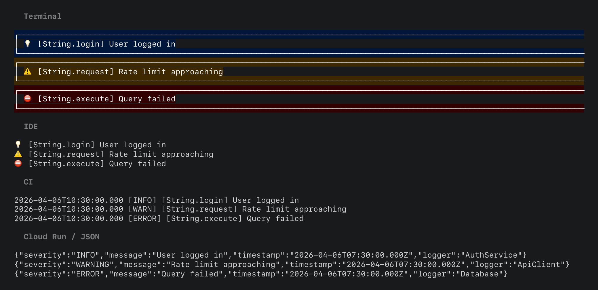
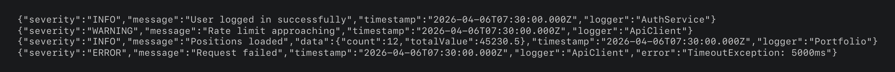
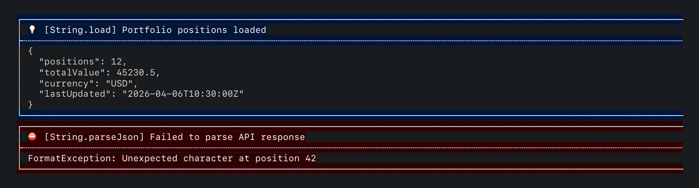
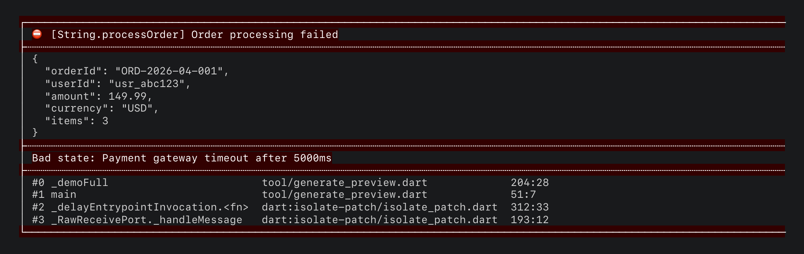

# hyper_logger

Composable, beautiful logging for Dart. Zero config. Every environment.



```dart
import 'package:hyper_logger/hyper_logger.dart';

HyperLogger.info<AuthService>('User logged in');
HyperLogger.error<Database>('Query failed', exception: e, stackTrace: st);
```

No init call. No setup. It auto-detects your environment, extracts the
class and method name, and picks the right output format.

## One line, every environment

`HyperLogger.init(printer: LogPrinterPresets.automatic())` detects
terminal, IDE, CI, and Cloud Run and selects the best format:

**Terminal** (emoji + box + ANSI colors)


**IDE** (emoji + prefix, clean)


**CI** (timestamp + prefix, machine-parseable)


**Cloud Run / JSON** (structured, Cloud Logging compatible)


Or compose your own from decorators. Order doesn't matter:

```dart
ComposablePrinter([
  const EmojiDecorator(),
  const AnsiColorDecorator(),
  const BoxDecorator(lineLength: 100),
  const TimestampDecorator(),
  const PrefixDecorator(),
]);
```


## Structured data and errors

Pass `data:` for pretty-printed JSON. Errors and stack traces render
in-box with level-appropriate colors:



Full error with data + exception + stack trace:



## The mixin

Mix into any class. Override `scopedLogger` for per-class config:

```dart
class PaymentService with HyperLoggerMixin<PaymentService> {
  @override
  final scopedLogger = HyperLogger.withOptions<PaymentService>(tag: 'payments');

  void process() {
    logInfo('Processing payment');
    // Output: 💡 [PaymentService.process] [payments] Processing payment
  }
}
```

## Scoped loggers

Per-feature tags, level filters, and runtime mode toggling. Cached and
mockable via `ScopedLoggerApi<T>`:

```dart
final log = HyperLogger.withOptions<NoisyService>(
  minLevel: LogLevel.warning,
  tag: 'noisy',
);
log.info('filtered out');     // no-op
log.warning('gets through');  // only warnings and above

log.mode = LogMode.disabled;  // toggle at runtime
```

## Crash reporting

Attach a delegate for Crashlytics or Sentry. It fires automatically on
`warning`, `error`, and `fatal` calls:

```dart
HyperLogger.attachServices(
  crashReporting: MyCrashReporter(),
);
```

The delegate fires even in `LogMode.silent` (output suppressed, reporting active).
See [example/crash_reporting_example.dart](example/crash_reporting_example.dart).

## Rate limiting

`ThrottledPrinter` wraps any printer to prevent hot loops from choking
the process (20x speedup in benchmarks):

```dart
HyperLogger.init(
  printer: ThrottledPrinter(LogPrinterPresets.terminal(), maxPerSecond: 30),
);
```

## Install

```yaml
dependencies:
  hyper_logger: ^0.0.1
```

## Documentation

| Guide | |
|---|---|
| [Flutter integration](doc/flutter.md) | Firebase Crashlytics/Analytics, error zones, `debugPrint`, build modes |
| [Configuration](doc/configuration.md) | `init()` params, log levels, filtering, ANSI colors |
| [Custom printers](doc/custom_printers.md) | `LogPrinter` interface, decorators, `ThrottledPrinter` |
| [Scoped loggers](doc/scoped_loggers.md) | `LoggerOptions`, caching, mode toggling |
| [HyperLoggerMixin](doc/mixin.md) | Mixin usage, scoped injection, testing |
| [Delegates](doc/delegates.md) | Crash reporting, error safety |
| [Testing](doc/testing.md) | Suppressing output, capturing logs, mocking |
| [Architecture](doc/architecture.md) | Pipeline design, `LogEntry`, internals |

Examples: [all presets](example/example.dart) | [mixin](example/mixin_example.dart) | [crash reporting](example/crash_reporting_example.dart) | [file logging](example/file_logger_example.dart) | [buffered remote](example/buffered_remote_logger_example.dart)

## License

See the repository root for license details.
