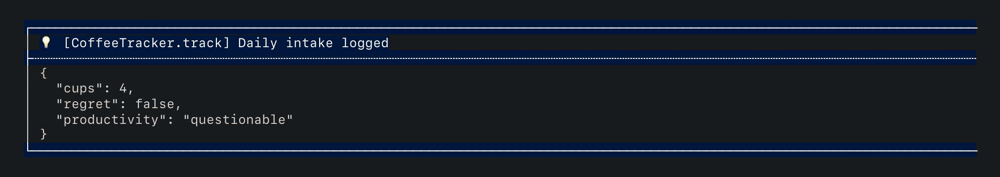

# Configuration

hyper_logger works out of the box with zero configuration. It detects
your environment (terminal, IDE, CI, Cloud Run, web) and picks the best
output format automatically. This page covers everything you can
customize when the defaults aren't enough.

## `HyperLogger.init()`

```dart
HyperLogger.init(
  printer: LogPrinterPresets.terminal(),
  mode: LogMode.enabled,
  captureStackTrace: true,
  interceptors: [
    (entry) => entry.loggerName.contains('NoisyLib') ? null : entry,
  ],
);
```

| Parameter | Type | Default | Effect |
|---|---|---|---|
| `printer` | `LogPrinter?` | auto-detected | The printer to use. See [Custom printers](custom_printers.md). |
| `mode` | `LogMode` | `enabled` | Global logging mode. See [Log modes](#log-modes). |
| `interceptors` | `List<LogInterceptor>?` | `null` | Filter, redact, enrich, or sample entries before they reach the printer. See [Interceptors](#interceptors). |
| `captureStackTrace` | `bool` | `true` | Auto-extract caller class and method from the stack trace. Disable for ~700ns savings per call. See [Explicit method names](#explicit-method-names). |
| `configureLoggingPackage` | `bool` | `true` | Sets `hierarchicalLoggingEnabled` and root level on `package:logging`. Set `false` if another package (Firebase, for example) already manages logging config. |
| `maxCacheSize` | `int` | `256` | LRU cache size for per-type loggers and scoped logger instances. Increase this if you log from hundreds of different types. |

You can call `init()` more than once. The printer carries over between
calls if you don't pass a new one. The `configureLoggingPackage` setup
only runs on the first call to avoid overriding other packages.

## Printer presets

If you don't pass a `printer`, hyper_logger picks one automatically. You
can also choose explicitly:

```dart
HyperLogger.init(printer: LogPrinterPresets.terminal());
```

| Preset | Decorators | Best for |
|---|---|---|
| `automatic()` | Detects environment | Default. Picks the right preset for you. |
| `terminal()` | Emoji + Box + ANSI color + Prefix | Local development in a terminal |
| `human(caps)` | Composed from `TerminalCapabilities` | Custom output streams; dispatch target for `automatic()`'s non-cloud / non-CI cases |
| `ci()` | Timestamp + Prefix | CI/CD log streams (machine-parseable) |
| `gcp()` | JSON output | Google Cloud Logging (Cloud Run, GKE, App Engine, Functions) |
| `aws()` | JSON output | AWS CloudWatch (Lambda, ECS, EKS) |

`human(caps)` composes by capability:

- ANSI + TTY → emoji + box + color + prefix (the `terminal()` shape)
- ANSI but no TTY → emoji + color + prefix, **no box** (IDE Run Console:
  ANSI is supported but column width is unknown)
- No ANSI → adds an inline timestamp (no host UI showing time per row)
  + emoji + prefix, no color
- Width is consumed by the box decorator: `human(caps)` passes
  `caps.width` (clamped 40–1024) into `BoxDecorator(lineLength: ...)`,
  so wide terminals get full-width borders and narrow ones get
  appropriately-sized ones. Falls back to 120 columns when
  `caps.width` is `null`.

On web platforms, hyper_logger uses `WebConsolePrinter` automatically,
which outputs to Chrome DevTools with `console.groupCollapsed`, CSS
styling, and `console.dir` for structured data.

All presets accept an optional `output` parameter to redirect where
lines go. See [Custom printers: Output sinks](custom_printers.md#custom-output-sinks).

### How `automatic()` detects your environment

Detection runs in this order: GCP managed runtimes (Cloud Run, App
Engine, Cloud Functions) → AWS managed runtimes (Lambda, ECS, Fargate) →
CI → human(capabilities). The first match wins. The fall-through `human`
case is itself capability-driven: it composes a preset from the live
stdout's ANSI / TTY / column-width support, so a real terminal, an IDE
Run Console, and a piped-to-file process each get the appropriate
decorator stack. Detection happens once at init time, not on every log
call.

IDE-launched processes (IntelliJ Run Configuration, VS Code Run/Debug,
Android Studio) are detected on macOS via `__CFBundleIdentifier`, which
the OS sets on child processes of GUI apps. On Linux and Windows there's
no comparable cross-IDE marker, so Run Configurations there fall through
to the no-ANSI fallback.

## Log levels

Every log call has a severity level. From least severe to most:

`trace` < `debug` < `info` < `warning` < `error` < `fatal`

Not all logs deserve the same attention. A debug message tracking widget
rebuilds is useful during development but noise in production. A failed
API call to your payment provider needs to be seen no matter what. Levels
give you that control: set a minimum, and everything below it is ignored.

```dart
HyperLogger.setLogLevel(LogLevel.warning); // Only WARNING and above
```

After this call, `trace`, `debug`, and `info` calls produce no output.
`warning`, `error`, and `fatal` still get through.

### `LogLevel` enum

| Value | Label | Emoji | Maps to |
|---|---|---|---|
| `trace` | TRACE | (none) | `Level.FINEST` |
| `debug` | DEBUG | `🐛` | `Level.FINE` |
| `info` | INFO | `💡` | `Level.INFO` |
| `warning` | WARN | `⚠️` | `Level.WARNING` |
| `error` | ERROR | `⛔` | `Level.SEVERE` |
| `fatal` | FATAL | `👾` | `Level.SHOUT` |

### Guarding expensive arguments

Sometimes you want to log something expensive to compute, but only if
that level is actually enabled. Building a large debug snapshot on every
call wastes time if debug logging is turned off:

```dart
if (HyperLogger.isEnabled(LogLevel.debug)) {
  final snapshot = buildWidgetTreeSnapshot();
  HyperLogger.debug<Inspector>('Widget tree', data: snapshot);
}
```

`isEnabled()` returns `false` when the global mode is `disabled` or
`silent`, or when the level is below the current threshold.

## Log modes

`LogMode` controls whether log output is printed and whether crash
reporting delegates fire. There are three modes, and understanding the
difference will save you from surprises in production.

### `LogMode.enabled`

The default. Everything works: console output prints, delegates fire.

### `LogMode.silent`

In production, your users don't see the console. But log output still
costs resources: every `print()` call takes time, and on Android, heavy
logging can actually slow down your app or get truncated by the system
logger. Even in debug mode, if a log spams hard enough, the Dart process
will freeze while the terminal tries to catch up. You literally cannot
hot-reload or hot-restart until it finishes.

`LogMode.silent` suppresses all console output but still forwards
warnings and errors to your crash reporting service (for example,
Firebase Crashlytics, Sentry, or any service that collects errors from
production). If you haven't set up crash reporting yet, see
[Delegates](delegates.md).

What fires in silent mode:

- `warning()` fires `CrashReportingDelegate.log()`
- `error()` fires `CrashReportingDelegate.recordError()`
- `fatal()` fires `CrashReportingDelegate.recordError(fatal: true)`
- `trace()`, `debug()`, `info()`, `stopwatch()` are fully suppressed

```dart
HyperLogger.init(mode: LogMode.silent);
HyperLogger.warning<Api>('timeout');
// Console: nothing
// Crash reporting service receives: "timeout"
```

### `LogMode.disabled`

A full shutdown. No output, no delegates, no work done. This is useful
during tests where you don't want logging side effects interfering with
your assertions, or in parts of your app where logging would be genuinely
wasteful (a tight animation loop, a high-frequency sensor callback,
etc.).

### `LogMode` and `minLevel`

These two filtering mechanisms serve different purposes.

`LogMode.silent` suppresses console output but still forwards to crash
reporting. `minLevel` suppresses everything: output, delegates, all of
it.

The distinction matters. If your payment service logs a warning and you
have `LogMode.silent`, that warning still reaches Crashlytics. If you
have `minLevel: LogLevel.error`, that warning disappears entirely. No
one sees it. No one gets paged.

If you're wondering which to use: `silent` is for production, where you
want quiet logs but still want to hear about problems. `minLevel` is for
filtering out noise you genuinely never need to see.

## Interceptors

Sometimes you need more control than level filtering gives you. Maybe a
third-party package logs aggressively at `info` level and you want to
suppress just its output without affecting your own `info` calls. Or you
want to redact secrets, enrich entries with build metadata, or sample
high-volume events.

Interceptors run in order before the printer sees the entry. Each receives
a `LogEntry` and returns either the entry (possibly modified) or `null`
to drop it. The first `null` short-circuits the chain.

```dart
HyperLogger.init(
  interceptors: [
    // 1. Drop noisy third-party logs entirely.
    (entry) {
      final name = entry.loggerName.toLowerCase();
      if (name.contains('gotrue')) return null;
      if (name.contains('supabase') && name.contains('auth')) return null;
      return entry;
    },

    // 2. Redact `password=...` and `token=...` from messages.
    (entry) => LogEntry(
      level: entry.level,
      message: entry.message
          .replaceAll(RegExp(r'password=\S+'), 'password=***')
          .replaceAll(RegExp(r'token=\S+'), 'token=***'),
      object: entry.object,
      loggerName: entry.loggerName,
      time: entry.time,
      error: entry.error,
      stackTrace: entry.stackTrace,
    ),
  ],
);
```

`LogEntry` fields available for filtering:

| Field | Type | Description |
|---|---|---|
| `level` | `LogLevel` | Severity level |
| `message` | `String` | The log message |
| `loggerName` | `String` | The type name passed as `<T>` |
| `time` | `DateTime` | When the record was created |
| `error` | `Object?` | Attached error, if any |
| `stackTrace` | `StackTrace?` | Attached stack trace, if any |
| `object` | `Object?` | The structured payload (a `LogMessage` internally) |

Filters run after level filtering but before the printer. Delegate calls
(crash reporting) happen before filters, so filtering a log entry does
not prevent it from reaching your crash reporting service.

## Structured data

Attach a `data` payload to any log call. Maps and iterables are
pretty-printed as indented JSON inside the log output:

```dart
HyperLogger.info<CoffeeTracker>('Daily intake logged', data: {
  'cups': 4,
  'regret': false,
  'productivity': 'questionable',
});
```

The data is rendered as indented JSON inside the log box:



Any value that isn't JSON-encodable falls back to `.toString()`. If
encoding fails entirely, the whole payload is printed as a raw string.
You don't need to worry about it crashing.

## Explicit method names

By default, hyper_logger captures `StackTrace.current` on every log call
to extract the calling class and method name. This is how
`[AuthService.login]` appears in the prefix without you doing anything.

Stack trace capture costs roughly 700 nanoseconds per call. In most apps
this is negligible, but if you're logging in a tight loop or performance-
critical path, you have two options:

Pass `method:` explicitly on a per-call basis to skip the capture:

```dart
HyperLogger.info<ApiClient>('Request sent', method: 'fetchUser');
// Output: 💡 [ApiClient.fetchUser] Request sent
```

Or disable stack trace capture globally:

```dart
HyperLogger.init(captureStackTrace: false);
// Method names will be omitted from prefixes unless provided explicitly.
```

## ANSI colors

`AnsiColor` supports true-color (24-bit) terminals. You can create
colors from RGB values, hex strings, or raw integer values:

```dart
AnsiColor.fromRGB(255, 165, 0)    // orange
AnsiColor.fromHex('#FFA500')       // same orange, accepts #RRGGBB, RRGGBB, #RGB, RGB
AnsiColor(0xFFFFA500)              // raw 0xAARRGGBB (alpha is ignored)
```

Adjust brightness on any color:

```dart
final muted = AnsiColor.orange.withBrightness(0.3);  // darker orange
final bright = AnsiColor.blue.withBrightness(1.5);    // brighter blue (clamped to 255)
```

Named constants are available: `AnsiColor.black`, `.white`, `.red`,
`.green`, `.blue`, `.yellow`, `.cyan`, `.magenta`, `.orange`, `.gray`,
`.lightGray`, `.darkGray`.

### Custom level colors

Override the background color used for each log level:

```dart
AnsiColorDecorator(customLevelColors: {
  LogLevel.warning: AnsiColor.fromHex('#FFA500'),
  LogLevel.error: AnsiColor.fromRGB(80, 0, 0),
})
```

### Custom emojis

Override the emoji prefix for each log level:

```dart
EmojiDecorator(customEmojis: {
  LogLevel.info: 'ℹ️ ',
  LogLevel.error: '🔥 ',
})
```

An empty string removes the emoji for that level entirely.
