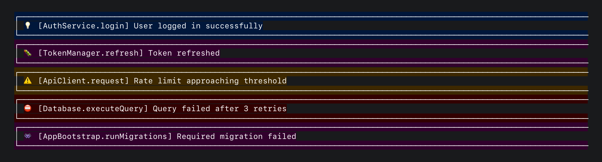
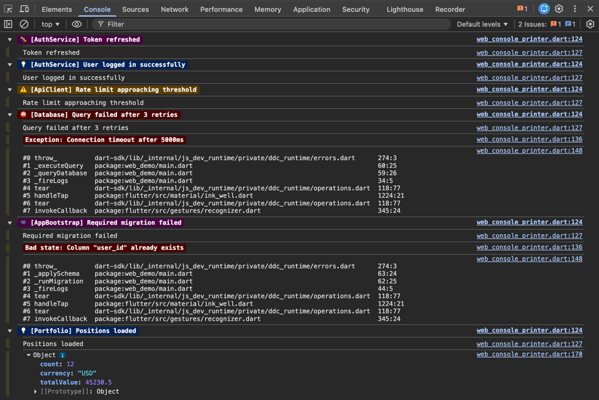
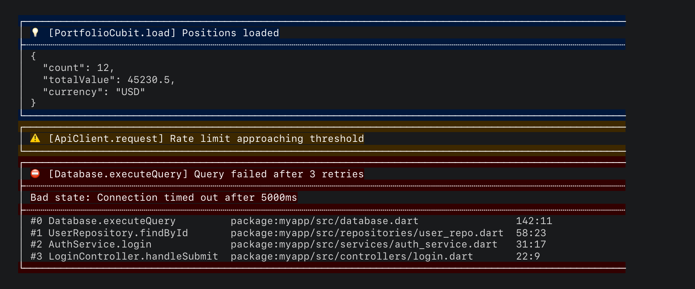
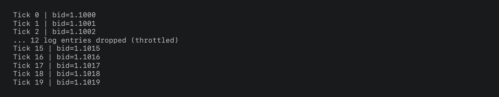

# Custom printers

hyper_logger ships with printers for every common environment. But if you
need to send logs to a remote service, write to a file, or format output
in a way that the built-in printers don't support, you can write your
own.

## The `LogPrinter` interface

```dart
abstract class LogPrinter {
  void log(LogEntry entry);
}
```

One method. Every printer receives a `LogEntry` with `level`, `message`,
`loggerName`, `time`, `error`, `stackTrace`, and `object`. No dependency
on `package:logging`. `LogEntry` is hyper_logger's own type.

## Built-in printers

| Printer | Purpose |
|---|---|
| `ComposablePrinter` | Decorator pipeline (boxes, colors, emoji, timestamps) |
| `JsonPrinter` | One JSON object per line (Cloud Logging compatible) |
| `DirectPrinter` | Raw `entry.message` passthrough, no formatting |
| `WebConsolePrinter` | Chrome DevTools `console.*` APIs with CSS styling |
| `ThrottledPrinter` | Rate-limiting wrapper around any printer |

### ComposablePrinter

This is the printer behind `terminal()`, `ide()`, and `ci()` presets. It
takes a list of decorators that configure the output style, then runs
each log entry through a three-stage pipeline: content extraction, style
resolution, and rendering.



```dart
ComposablePrinter(
  [
    const EmojiDecorator(),
    const BoxDecorator(lineLength: 100),
    const AnsiColorDecorator(),
    const PrefixDecorator(),
  ],
  methodCount: 10,          // Stack trace frames to show
  errorMethodCount: 20,     // More frames for error-level logs (null = use methodCount)
  excludePaths: ['package:noisy_dep/'],  // Hide frames from these libraries
  showAsyncGaps: true,      // Show "asynchronous gap" separators in stack traces
  output: print,            // Where formatted lines go
);
```

| Parameter | Type | Default | Effect |
|---|---|---|---|
| `decorators` | `List<LogDecorator>` | required | Style configuration. Order doesn't matter. |
| `methodCount` | `int` | `10` | Number of stack trace frames to include |
| `errorMethodCount` | `int?` | `null` | Frame count for error-level logs. Falls back to `methodCount`. |
| `excludePaths` | `List<String>` | `[]` | Library paths to exclude from stack traces |
| `showAsyncGaps` | `bool` | `false` | Show async gap separators between traces |
| `output` | `LogOutput` | `print` | Output sink callback |

`ComposablePrinter` also exposes a `format(LogEntry)` method that
returns the formatted lines as a `List<String>` without printing them.
Useful if you need to post-process the output.

### JsonPrinter

Emits one JSON object per line, compatible with Google Cloud Logging
structured log format:

```dart
const JsonPrinter(output: print);
```

Output:

```json
{"severity":"INFO","message":"Daily intake logged","data":{"cups":4,"regret":false},"timestamp":"2026-04-08T12:00:00.000Z","logger":"CoffeeTracker"}
```

Level mapping to Cloud Logging severity:

| LogLevel | Severity |
|---|---|
| `trace`, `debug` | `DEBUG` |
| `info` | `INFO` |
| `warning` | `WARNING` |
| `error` | `ERROR` |
| `fatal` | `CRITICAL` |

### DirectPrinter

The simplest possible printer. Passes `entry.message` straight to the
output callback with no formatting, no colors, no boxes:

```dart
const DirectPrinter(output: print);
```

This is primarily useful for tests (capture output into a list) and for
environments where any formatting would be a problem.

### WebConsolePrinter

Used automatically on web platforms. Uses Chrome DevTools APIs for
structured output:

```dart
WebConsolePrinter(
  methodCount: 8,        // Stack trace frames
  errorMethodCount: null, // Falls back to methodCount
);
```

Each log entry becomes a `console.groupCollapsed` call with CSS-styled
headers (colored badges per level). Inside the group:

- `console.log` for the message text
- `console.dir` for structured data (native expandable object tree)
- CSS-styled `console.log` for exceptions
- Formatted stack trace text

You don't need to configure this manually. It's selected automatically
when running on web.



## Decorator composition

Decorators configure the output style by writing flags into a `LogStyle`
property bag at construction time:

```dart
final printer = ComposablePrinter([
  const EmojiDecorator(),
  const BoxDecorator(lineLength: 100),
  const AnsiColorDecorator(),
  const TimestampDecorator(),
  const PrefixDecorator(),
]);
```

Each decorator owns a non-overlapping set of fields, so order is
irrelevant. Shuffle them, reorder them, the output stays the same.



| Decorator | Fields | Effect |
|---|---|---|
| `BoxDecorator` | `box`, `lineLength` | Box-drawing border around log entries |
| `EmojiDecorator` | `emoji`, `levelEmojis` | Level emoji prefix (e.g. 💡 for info) |
| `AnsiColorDecorator` | `ansiColors`, `levelColors` | 24-bit ANSI terminal colors |
| `TimestampDecorator` | `timestamp`, `dateTimeFormatter` | ISO-8601 timestamp (or custom format) |
| `PrefixDecorator` | `prefix` | `[ClassName.methodName]` bracket prefix |

### Customizing decorators

Most decorators accept optional parameters:

```dart
// Custom line width for the box
const BoxDecorator(lineLength: 80)

// Custom emoji per level
EmojiDecorator(customEmojis: {
  LogLevel.info: 'ℹ️ ',
  LogLevel.error: '🔥 ',
})

// Custom colors per level
AnsiColorDecorator(customLevelColors: {
  LogLevel.warning: AnsiColor.fromHex('#FFA500'),
})

// Custom timestamp format
TimestampDecorator(formatter: (dt) => '${dt.hour}:${dt.minute}:${dt.second}')
```

See [Configuration: ANSI colors](configuration.md#ansi-colors) for the
full `AnsiColor` API.

### Writing a custom decorator

```dart
class VerboseDecorator extends LogDecorator {
  const VerboseDecorator();

  @override
  void apply(LogStyle style) {
    style.box = true;
    style.emoji = true;
    style.timestamp = true;
    style.prefix = true;
    style.ansiColors = true;
  }
}
```

`LogStyle` fields you can set:

| Field | Type | Default | Description |
|---|---|---|---|
| `box` | `bool` | `false` | Draw box border |
| `emoji` | `bool` | `false` | Show emoji prefix |
| `ansiColors` | `bool` | `false` | Apply ANSI color codes |
| `timestamp` | `bool` | `false` | Include timestamp section |
| `prefix` | `bool` | `true` | Show `[Class.method]` prefix |
| `lineLength` | `int` | `120` | Max line width |
| `levelEmojis` | `Map<LogLevel, String>?` | `null` | Per-level emoji overrides |
| `levelColors` | `Map<LogLevel, AnsiColor>?` | `null` | Per-level color overrides |
| `dateTimeFormatter` | `DateTimeFormatter?` | `null` | Custom timestamp formatter |

## ThrottledPrinter

Sometimes you put a log line in a function that triggers thousands of
times per second. Your Dart process hangs while the console tries to
catch up, and you can't even hot-restart until it finishes.
`ThrottledPrinter` prevents this by rate-limiting any printer:

```dart
final printer = ThrottledPrinter(
  LogPrinterPresets.terminal(),
  maxPerSecond: 30,    // default: 30
  maxQueueSize: 200,   // default: 500
);

HyperLogger.init(printer: printer);
```

Entries up to `maxPerSecond` are forwarded immediately. Excess entries
are queued and drained gradually. When the queue exceeds `maxQueueSize`,
the oldest entries are dropped and a summary is emitted:



Call `flush()` on app shutdown to drain remaining entries:

```dart
// In your app's dispose or shutdown logic:
(printer as ThrottledPrinter).flush();
```

## Writing a custom printer

Implement `LogPrinter` and do whatever you want with the `LogEntry`:

```dart
class BufferedRemotePrinter implements LogPrinter {
  final List<LogEntry> _buffer = [];
  final int batchSize;
  final void Function(List<LogEntry> batch) onFlush;

  BufferedRemotePrinter({this.batchSize = 50, required this.onFlush});

  @override
  void log(LogEntry entry) {
    _buffer.add(entry);
    if (_buffer.length >= batchSize) flush();
  }

  void flush() {
    if (_buffer.isEmpty) return;
    final batch = List<LogEntry>.of(_buffer);
    _buffer.clear();
    onFlush(batch);
  }
}
```

See [example/buffered_remote_logger_example.dart](../example/buffered_remote_logger_example.dart)
for a complete, runnable version of this.

## Custom output sinks

Every printer that produces text output accepts a `LogOutput` callback:

```dart
// Route through Flutter's debugPrint (prevents Android log truncation)
final printer = LogPrinterPresets.terminal(
  output: (s) => debugPrint(s),
);

// Write to a file
final printer = LogPrinterPresets.ci(
  output: (s) => logFile.writeAsStringSync('$s\n', mode: FileMode.append),
);

// Capture in tests
final captured = <String>[];
final printer = DirectPrinter(output: captured.add);
```
