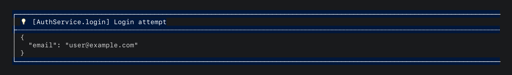

# HyperLoggerMixin

If a class logs frequently, typing `HyperLogger.info<MyClass>(...)` on
every call gets repetitive. The `<MyClass>` type parameter is always the
same within that class, so you're repeating yourself for no reason.

`HyperLoggerMixin<T>` gives any class instance-level logging methods
that forward the type parameter automatically.

## Basic usage

```dart
class AuthService with HyperLoggerMixin<AuthService> {
  void login(String email) {
    logInfo('Login attempt', data: {'email': email});
  }
}
```



Without any configuration, the mixin delegates to `HyperLogger` static
methods, forwarding `<T>` for you. All global settings (mode, filters,
printer, delegates) apply exactly as they would with a direct
`HyperLogger.info<AuthService>(...)` call.

## With a scoped logger

Override `scopedLogger` to use per-class tags, level filters, or mode
control:

```dart
class PaymentService with HyperLoggerMixin<PaymentService> {
  @override
  final scopedLogger = HyperLogger.withOptions<PaymentService>(
    tag: 'payments',
    minLevel: LogLevel.info,
  );

  void process() {
    logInfo('Processing payment');
    // Output: 💡 [PaymentService.process] [payments] Processing payment

    logDebug('Connecting to gateway');
    // Nothing. debug is below info.
  }
}
```

When `scopedLogger` is provided, all `logX` methods delegate to it
instead of the global `HyperLogger`. This gives you per-class tags,
level filtering, mode control, and `skipCrashReporting` defaults.

See [Scoped loggers](scoped_loggers.md) for full details on what options
are available.

## How delegation works

The mixin checks `scopedLogger` on every call:

```dart
void logInfo(String msg, {Object? data, String? method}) {
  final s = scopedLogger;
  s != null
      ? s.info(msg, data: data, method: method)
      : HyperLogger.info<T>(msg, data: data, method: method);
}
```

- If `scopedLogger` returns a `ScopedLoggerApi<T>`, all calls go
  through it. The scoped logger's mode, minLevel, tag, and
  skipCrashReporting settings apply.
- If `scopedLogger` returns `null` (the default), calls fall back to the
  corresponding `HyperLogger` static method with `<T>` forwarded. Global
  settings apply.

The full chain when a scoped logger is present:
`logInfo()` -> `ScopedLogger.info()` -> `HyperLogger.info<T>()`

The scoped logger applies its own filtering and tagging, then delegates
to the global `HyperLogger` for printing and delegate dispatch.

## Available methods

| Method | Delegates to |
|---|---|
| `logTrace(msg, {data, method})` | `trace()` |
| `logDebug(msg, {data, method})` | `debug()` |
| `logInfo(msg, {data, method})` | `info()` |
| `logWarning(msg, {data, method})` | `warning()` |
| `logError(msg, {exception, stackTrace, data, method, skipCrashReporting})` | `error()` |
| `logFatal(msg, {exception, stackTrace, data, method})` | `fatal()` |
| `logStopwatch(msg, stopwatch, {method})` | `stopwatch()` |

## Injecting for tests

Make `scopedLogger` settable so tests can inject a mock:

```dart
class MyService with HyperLoggerMixin<MyService> {
  @override
  final ScopedLoggerApi<MyService>? scopedLogger;

  MyService({this.scopedLogger});
}
```

In your test:

```dart
final mock = MockLogger();
final service = MyService(scopedLogger: mock);
service.doWork();
expect(mock.infoCalls, contains('work started'));
```

`ScopedLoggerApi<T>` is an interface, so any test double that implements
it works. No special mocking library required.

See [Testing](testing.md) for more patterns.

## When to use the mixin vs. other approaches

If you're just getting started, `HyperLogger.info<T>(...)` is all you
need. Reach for the mixin when you find yourself repeating the same
type parameter in a class over and over. For a full comparison table,
see [Scoped loggers: When to use scoped loggers](scoped_loggers.md#when-to-use-scoped-loggers).

See [example/mixin_example.dart](../example/mixin_example.dart) for a
full runnable example.
