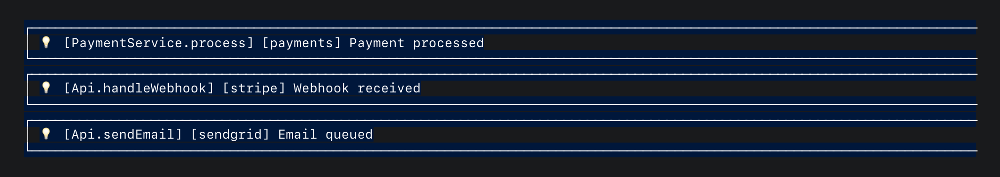

# Scoped loggers

Not every part of your app should log the same way. Your payment service
probably needs stricter filtering than your debug toolbar. A noisy
analytics module might need its own tag so you can spot it (or silence it)
in the output. Scoped loggers let you configure logging per-feature
without touching the global settings.

## Creating a scoped logger

Scoped loggers use `minLevel` to filter by severity. If you're not
familiar with how log levels work, see
[Configuration: Log levels](configuration.md#log-levels) first.

Here's a scoped logger that tags all output with `[payments]` and filters
out anything below `info`:

```dart
final log = HyperLogger.withOptions<PaymentService>(
  tag: 'payments',
  minLevel: LogLevel.info,
);

log.info('Payment processed');
// Output: 💡 [PaymentService.process] [payments] Payment processed

log.debug('Retrying Stripe webhook');
// Nothing. debug is below info in the hierarchy, so this is filtered out.
```

You can also build options separately and reuse them across multiple
loggers:

```dart
const opts = LoggerOptions(tag: 'billing', minLevel: LogLevel.warning);
final log = HyperLogger.fromOptions<Billing>(opts);
```

## LoggerOptions

| Option | Type | Default | Effect |
|---|---|---|---|
| `mode` | `LogMode` | `enabled` | `enabled`, `silent`, or `disabled`. See [Configuration: Log modes](configuration.md#log-modes). |
| `minLevel` | `LogLevel?` | `null` | Per-scope level filter. See [Configuration: Log levels](configuration.md#log-levels). |
| `tag` | `String?` | `null` | Prepends `[tag]` to every message |
| `skipCrashReporting` | `bool` | `false` | Default for error calls (overridable per-call) |

## Tags

Tags prepend a bracketed label to every message from that scoped logger.
This is useful when multiple features log through the same class type, or
when you want to grep your console output for a specific subsystem:

```dart
final log = HyperLogger.withOptions<Api>(tag: 'stripe');
log.info('Webhook received');

final log2 = HyperLogger.withOptions<Api>(tag: 'sendgrid');
log2.info('Email queued');
```



Tags are preserved across all modes. In `LogMode.silent`, your crash
reporting service still receives the tagged message:

```dart
final log = HyperLogger.withOptions<Api>(tag: 'stripe', mode: LogMode.silent);
log.warning('rate limited');
// Console: nothing
// Crash reporting receives: "[stripe] rate limited"
```

One thing to watch out for: passing an empty string (`tag: ''`) is not
the same as `null`. It will prepend `[]` to every message, which is
probably not what you intended. Use `null` (or just omit `tag`) if you
don't want a tag.

## skipCrashReporting

By default, `warning()`, `error()`, and `fatal()` forward to your crash
reporting delegate. But sometimes a specific scope handles its own error
recovery and you don't want those errors cluttering your crash dashboard.

Set `skipCrashReporting: true` in the options to disable delegate
forwarding for that scope's `error()` calls:

```dart
final log = HyperLogger.withOptions<ImageCache>(
  tag: 'image-cache',
  skipCrashReporting: true,
);

log.error('Cache miss, falling back to network', exception: e);
// Output prints normally, but the crash reporting delegate is NOT called.
// This error is expected and handled. No need to page anyone.
```

You can also override it per-call. If most errors in a scope are
expected, but one is genuinely worth reporting:

```dart
log.error('Disk full, cannot write cache', exception: e,
    skipCrashReporting: false); // Override: this one matters
```

`fatal()` always reports to crash reporting regardless of this setting.
If something is fatal, you want to know about it. No exceptions.

## Stopwatch logging

`stopwatch()` logs at `info` level. If your scoped logger has
`minLevel: LogLevel.warning` or higher, stopwatch logs will be silently
filtered out:

```dart
final log = HyperLogger.withOptions<Database>(minLevel: LogLevel.warning);

final sw = Stopwatch()..start();
await db.query('SELECT * FROM users');
sw.stop();

log.stopwatch('Query completed', sw);
// Nothing. stopwatch logs at info, which is below warning.
```

If you need timing data from a scope that filters heavily, either lower
the `minLevel` or use a separate scoped logger for performance tracking.

## Scoped mode vs. global mode

A scoped logger has its own `mode`, but the global mode set via
`HyperLogger.init()` still applies. If the global mode is `disabled`,
nothing gets through, regardless of what the scoped logger's mode is set
to. The global mode acts as a ceiling:

| Global mode | Scoped mode | Result |
|---|---|---|
| `enabled` | `enabled` | Normal output + delegates |
| `enabled` | `silent` | No output, delegates fire |
| `enabled` | `disabled` | Full shutdown for this scope |
| `disabled` | `enabled` | Full shutdown for everything |
| `silent` | `enabled` | No output, delegates fire |

The scoped mode can only be *more* restrictive than the global mode,
never less.

## When to use scoped loggers

| Approach | Best for |
|---|---|
| `HyperLogger.info<T>(...)` | One-off calls, scripts, top-level functions |
| `HyperLoggerMixin<T>` | Classes that log frequently; avoids repeating `<T>`. See [HyperLoggerMixin](mixin.md). |
| `ScopedLogger` directly | Feature modules that need tags, level filters, or mode toggling |
| Mixin + `scopedLogger` | Classes that log frequently AND need scoped config |

If you're just getting started, `HyperLogger.info<T>(...)` is all you
need. Reach for scoped loggers when you find yourself wanting per-feature
control.

## Mocking in tests

When you're testing a class that logs, you probably don't want real log
output cluttering your test runner. You also might want to verify that
specific log calls happened. `ScopedLoggerApi<T>` is an interface, so
you can mock it directly:

```dart
class MockLogger implements ScopedLoggerApi<MyService> {
  final calls = <String>[];

  @override
  void info(String msg, {Object? data, String? method}) => calls.add(msg);

  @override
  void trace(String msg, {Object? data, String? method}) => calls.add(msg);

  // ... all methods
}
```

Inject the mock via constructor, or override `scopedLogger` in the mixin.
See [Testing](testing.md) for a full example.

## Caching and runtime mode toggling

Scoped loggers are cached. Two calls with the same type and options
return the exact same object:

```dart
final a = HyperLogger.withOptions<CoffeeTracker>(tag: 'caffeine');
final b = HyperLogger.withOptions<CoffeeTracker>(tag: 'caffeine');
print(identical(a, b)); // true
```

Different options produce different instances:

```dart
final a = HyperLogger.withOptions<CoffeeTracker>(tag: 'caffeine');
final b = HyperLogger.withOptions<CoffeeTracker>(tag: 'decaf');
print(identical(a, b)); // false
```

The cache key includes all five options: type, mode, minLevel, tag, and
skipCrashReporting. All five must match for a cache hit.

This is efficient, but it has a consequence: if you set
`a.mode = LogMode.disabled`, you just disabled `b` too. Every reference
pointing to that cached instance sees the change.

This is powerful for feature flags. One flip silences an entire feature
across your app:

```dart
final log = HyperLogger.withOptions<Analytics>(tag: 'analytics');

// User opts out of analytics in settings:
log.mode = LogMode.disabled;
// Every class holding this scoped logger goes quiet. One flip, done.
```

If you expected isolated instances, this will surprise you. Each unique
combination of type + options is one shared instance across your entire
app.

## Available methods

`ScopedLoggerApi<T>` provides: `trace`, `debug`, `info`, `warning`,
`error`, `fatal`, `stopwatch`.
